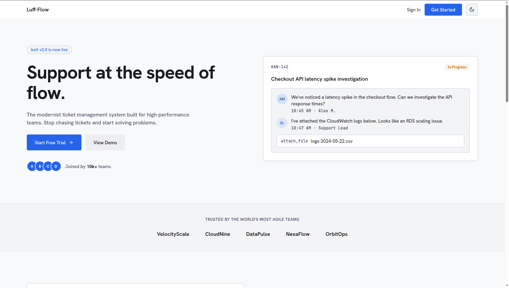
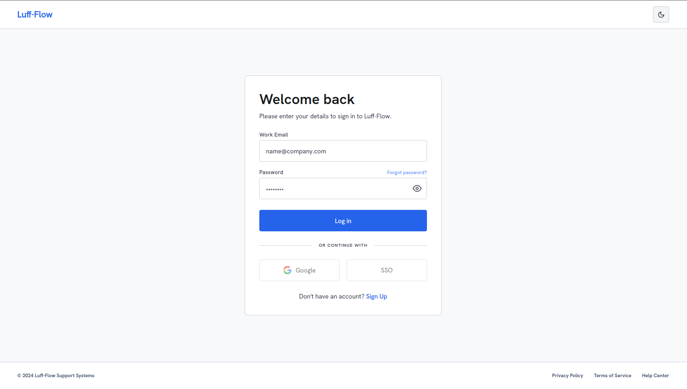
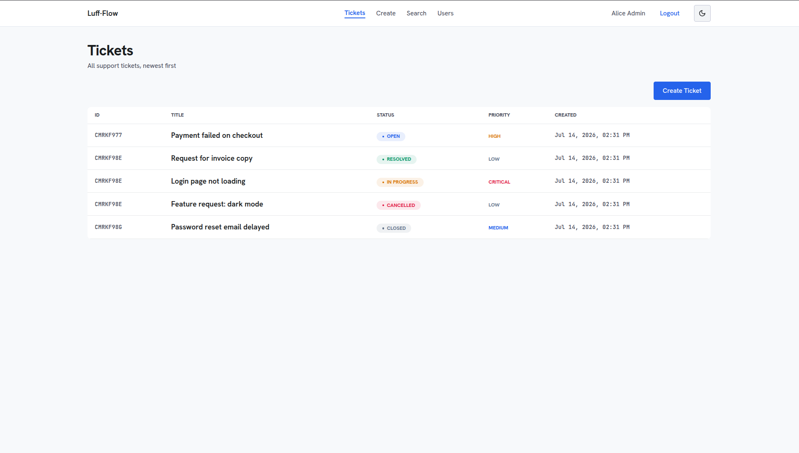

# Luff - Flow   |   Support Ticket Management System

A full-stack application for managing support tickets with a strict status state machine, built with Clean Architecture principles.

https://frontend-alpha-murex-89.vercel.app/

## Demo Accounts

Use these accounts after running `npm run db:seed` (or `npm run db:seed:demo` for users only):

| Email | Password | Role | Access |
|-------|----------|------|--------|
| `user@example.com` | `Password123!` | USER | View only |
| `agent@example.com` | `Password123!` | AGENT | Create & manage tickets |
| `admin@example.com` | `Password123!` | ADMIN | Full access + Users tab |

## Screenshots

Design screens exported from [Stitch](https://stitch.withgoogle.com) (see [`DESIGN.md`](./DESIGN.md)).

### Landing page



### Login



### Ticket list



## Tech Stack

| Layer | Technology |
|-------|------------|
| Frontend | Next.js 15 (App Router), React 19, TypeScript, TailwindCSS, React Hook Form, Zod, Axios |
| Backend | Node.js, Express 5, TypeScript |
| ORM | Prisma 6 |
| Database | PostgreSQL (Neon serverless supported) |
| Design | Luff-Flow design system via Stitch MCP → [`DESIGN.md`](./DESIGN.md) |
| Testing | Vitest, Supertest |

## Quick Start

```bash
# 1. Backend
cd backend && npm install
cp .env.example .env          # add your DATABASE_URL (local or Neon)
npx prisma migrate deploy
npm run db:seed
npm run dev                     # http://localhost:3001

# 2. Frontend (new terminal)
cd frontend && npm install
cp .env.example .env.local
npm run dev                     # http://localhost:3000

# 3. Tests
cd backend && npm test          # 34 tests
```

## Deploy to Vercel

Use **two Vercel projects** (backend + frontend) from the same GitHub repo. Full guide: [`docs/deployment-vercel.md`](./docs/deployment-vercel.md).

| Project | Root directory | Key env vars |
|---------|----------------|--------------|
| API | `backend` | `DATABASE_URL`, `CORS_ORIGIN` |
| Web | `frontend` | `NEXT_PUBLIC_API_URL` |

```bash
# 1. Push to GitHub, then import twice at vercel.com/new

# 2. Backend — set DATABASE_URL (Neon pooler URL) and CORS_ORIGIN
#    Verify: curl https://YOUR-API.vercel.app/api/health

# 3. Frontend — set NEXT_PUBLIC_API_URL=https://YOUR-API.vercel.app/api

# 4. Update backend CORS_ORIGIN with frontend URL, redeploy backend

# Optional: seed production DB
cd backend && DATABASE_URL="..." npm run db:seed
```

Or via CLI (after `npx vercel login`):

```bash
cd backend && npx vercel --prod    # deploy API first
cd ../frontend && npx vercel --prod
```

---

## Folder Structure

```
C1-Assignment/
├── DESIGN.md                  # UI design tokens (single source of truth)
├── README.md
├── tool-workflow.md           # AI-assisted development workflow
├── docs/
│   └── api.md                 # API reference
├── planning/                  # M1 design documents + milestone roadmap
│   ├── milestones.md          # Master milestone index (M1–M16)
│   ├── auth-design.md         # M8 authentication spec
│   ├── requirements.md
│   ├── assumptions.md
│   ├── architecture.md
│   ├── database-design.md
│   ├── api-design.md
│   ├── state-machine.md
│   └── user-stories.md
├── pulse/                     # Live project status
│   ├── current.md             # Health snapshot
│   ├── milestone-log.md       # Completed milestones
│   └── upcoming.md            # Planned work (M9+)
├── prompts/                   # AI prompt history
├── testing/
│   ├── test-plan.md
│   └── integration-results.md
├── review/
│   ├── ai-review.md
│   ├── self-review.md
│   └── future-improvements.md
├── reflection/
│   └── reflection.md
├── backend/
│   ├── prisma/
│   │   ├── schema.prisma      # User, Ticket, Comment models
│   │   ├── seed.ts
│   │   └── migrations/
│   └── src/
│       ├── config/            # Env validation, Prisma client
│       ├── controllers/       # HTTP handlers
│       ├── services/          # Business logic + state machine
│       ├── repositories/      # Data access (Prisma)
│       ├── routes/            # Express routes
│       ├── validators/        # Zod schemas
│       ├── middlewares/       # Error handler
│       ├── types/             # Domain & API types
│       ├── utils/             # AppError, response helpers
│       └── tests/             # Unit + integration tests
└── frontend/
    ├── app/                   # Next.js pages
    ├── components/            # UI + ticket components
    ├── services/              # Axios API client
    ├── types/                 # TypeScript types
    └── utils/                 # Errors, status, validators
```

---

## Database

### Schema

| Model | Key Fields |
|-------|------------|
| **User** | id, name, email, role (`ADMIN`, `AGENT`, `USER`) |
| **Ticket** | id, title, description, priority, status, assignedToId, createdById |
| **Comment** | id, ticketId, message, createdById |

### Enums

- **Priority:** `LOW`, `MEDIUM`, `HIGH`, `CRITICAL`
- **Status:** `OPEN`, `IN_PROGRESS`, `RESOLVED`, `CLOSED`, `CANCELLED`

### Setup (Local PostgreSQL)

```bash
createdb support_tickets
# Set DATABASE_URL in backend/.env
cd backend && npx prisma migrate deploy && npm run db:seed
```

### Setup (Neon PostgreSQL)

1. Create a project at [neon.tech](https://neon.tech)
2. Copy the connection string (include `?sslmode=require`)
3. Set `DATABASE_URL` in `backend/.env`
4. Run `npx prisma migrate deploy && npm run db:seed`
5. **Restart** the backend dev server after changing `.env`

See [`planning/database-design.md`](./planning/database-design.md) for ERD and referential integrity.

---

## State Machine

Enforced in `backend/src/services/ticketStatusMachine.ts` (service layer only).

| From | Valid Transitions |
|------|-------------------|
| OPEN | → IN_PROGRESS, CANCELLED |
| IN_PROGRESS | → RESOLVED, CANCELLED |
| RESOLVED | → CLOSED |
| CLOSED | (terminal) |
| CANCELLED | (terminal) |

Invalid transitions return **HTTP 409** with message: `Invalid status transition from X to Y`

See [`planning/state-machine.md`](./planning/state-machine.md) for diagram and test cases.

---

## API Endpoints

| Method | Endpoint | Description |
|--------|----------|-------------|
| GET | `/api/health` | Health check |
| GET | `/api/users` | List users |
| POST | `/api/tickets` | Create ticket |
| GET | `/api/tickets` | List tickets |
| GET | `/api/tickets/:id` | Ticket details + comments |
| PUT | `/api/tickets/:id` | Update ticket (not status) |
| PATCH | `/api/tickets/:id/status` | Change status (state machine) |
| POST | `/api/tickets/:id/comments` | Add comment |
| GET | `/api/tickets/search` | Search (`?q=`, `?status=`) |

Full reference: [`docs/api.md`](./docs/api.md)

---

## Architecture

```
Routes → Controllers → Services → Repository Interfaces → Prisma
```

- **State machine** lives in Services — never in controllers or repositories
- **Validation** at API boundary via Zod middleware
- **Error envelope:** `{ success, data?, error: { message, code, details? } }`

See [`planning/architecture.md`](./planning/architecture.md).

---

## Frontend Pages

| Route | Page |
|-------|------|
| `/` | Ticket List |
| `/tickets/new` | Create Ticket |
| `/tickets/[id]` | Ticket Details (comments, status, assign) |
| `/search` | Search & Filter |

Styling: [`DESIGN.md`](./DESIGN.md) — Hanken Grotesk + JetBrains Mono, Luff-Flow tokens.

---

## Testing

```bash
cd backend && npm test
```

| Suite | Tests | Status |
|-------|-------|--------|
| Unit (state machine + health) | 12 | ✅ |
| Integration (API + state machine) | 22 | ✅ |
| **Total** | **34** | **✅ All passing** |

> Integration tests reset the database. Run `npm run db:seed` after tests to restore sample data.

See [`testing/test-plan.md`](./testing/test-plan.md) and [`testing/integration-results.md`](./testing/integration-results.md).

---

## Environment Variables

### Backend (`backend/.env`)

| Variable | Required | Default | Description |
|----------|----------|---------|-------------|
| `PORT` | No | `3001` | Server port |
| `NODE_ENV` | No | `development` | Environment |
| `DATABASE_URL` | Yes | — | PostgreSQL connection string |
| `CORS_ORIGIN` | No | `http://localhost:3000` | Frontend origin |

### Frontend (`frontend/.env.local`)

| Variable | Required | Default | Description |
|----------|----------|---------|-------------|
| `NEXT_PUBLIC_API_URL` | No | `http://localhost:3001/api` | Backend API base URL |

---

## Scripts

### Backend

| Script | Description |
|--------|-------------|
| `npm run dev` | Dev server with hot reload |
| `npm run build` | Compile TypeScript |
| `npm test` | Run all tests |
| `npm run db:migrate` | Run migrations (dev) |
| `npm run db:migrate:deploy` | Run migrations (prod/Neon) |
| `npm run db:seed` | Seed sample data |
| `npm run db:studio` | Prisma Studio GUI |

### Frontend

| Script | Description |
|--------|-------------|
| `npm run dev` | Next.js dev server |
| `npm run build` | Production build |
| `npm start` | Run production build |

---

## Documentation Index

| Document | Purpose |
|----------|---------|
| [`DESIGN.md`](./DESIGN.md) | UI design tokens |
| [`docs/api.md`](./docs/api.md) | API reference |
| [`planning/milestones.md`](./planning/milestones.md) | Milestone roadmap (M1–M16) |
| [`planning/auth-design.md`](./planning/auth-design.md) | M8 authentication spec |
| [`docs/deployment-vercel.md`](./docs/deployment-vercel.md) | **Deploy to Vercel** (frontend + backend) |
| [`tool-workflow.md`](./tool-workflow.md) | AI development workflow |
| [`planning/`](./planning/) | Requirements, architecture, milestones |
| [`pulse/`](./pulse/) | **Live status** — current health, milestone log, upcoming |
| [`testing/`](./testing/) | Test plan and results |
| [`review/`](./review/) | Code reviews |
| [`reflection/`](./reflection/) | Project reflection |
| [`prompts/`](./prompts/) | AI prompt history |

## License

ISC
